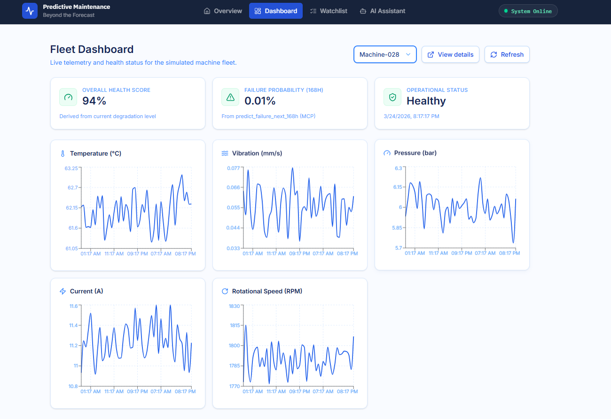
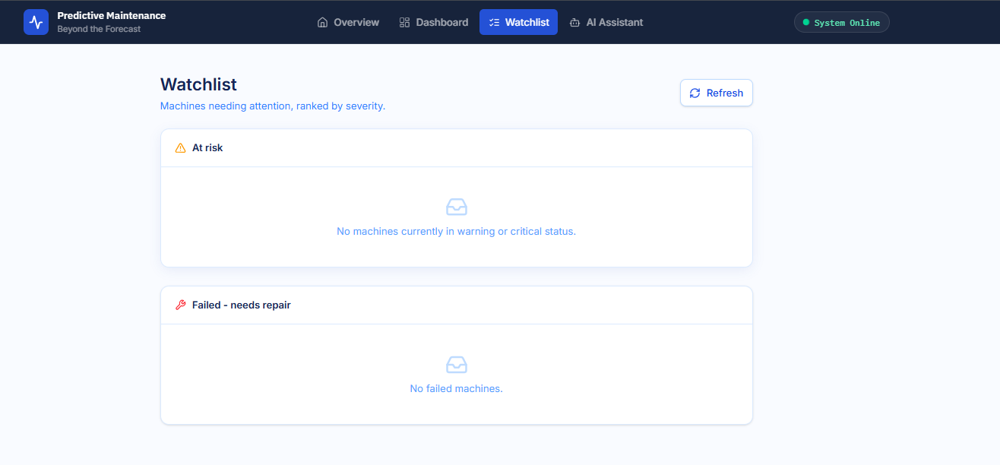
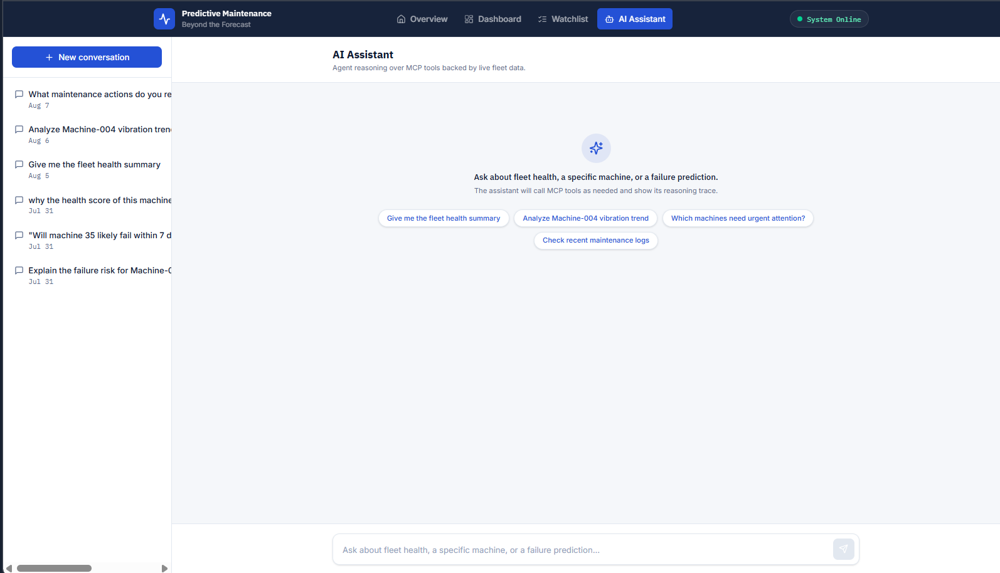

# A Feasibility Study for an IoT Solution Dedicated to Predictive Maintenance

*Analysis of the technical feasibility of developing a functional prototype (PoC)*

A local feasibility study exploring whether a **structured ML model (XGBoost)** and an **LLM reasoning layer (via MCP)** can be combined into a single, explainable predictive maintenance system for industrial IoT, no cloud infrastructure, running entirely on a personal laptop.

The system simulates a fleet of industrial machines, predicts failure risk from sensor telemetry, and lets an LLM query that model plus machine specs, maintenance history, and a knowledge base, through the [Model Context Protocol (MCP)](https://modelcontextprotocol.io) to produce grounded, explainable answers instead of hallucinated ones.

> **Status:** active internship project / feasibility study. Not production-hardened : see [Roadmap](#roadmap) for what's still in progress.

---

## Why this project

Most industrial predictive maintenance demos are either:
- a black-box ML model that spits out a probability with no explanation, or
- an LLM chatbot that reasons fluently but isn't grounded in real sensor data.

This project tests whether combining the two : a trained classifier for the *prediction*, and an LLM + MCP tool layer for the *reasoning and explanation*  is a viable, cheap-to-build architecture for industrial IoT maintenance workflows.

---

## Architecture overview

```
┌─────────────────────┐         ┌──────────────────────────┐        ┌────────────────────┐
│   Simulator          │──────▶│   Supabase (Postgres)     │◀──────│   MCP Server         │
│  (Fleet A + Fleet B)  │       │  sensor_data, machines,   │        │  tools / resources / │
│  synthetic sensor data│       │  machine_live_state,      │        │  prompts             │
└─────────────────────┘        │ knowledge base tables     │        └─────────┬──────────┘
                                 └──────────────────────────┘                  │
                                            ▲                                  ▼
                                            │                          ┌────────────────────┐
                                 ┌──────────────────────┐              │   LLM Host (FastAPI)│
                                 │  XGBoost model         │◀────────── │   + Gemini API      │
                                 │  failure_next_168h     │             └─────────┬──────────┘
                                 └──────────────────────┘                       │
                                                                                 ▼
                                                                       ┌────────────────────┐
                                                                       │   Frontend (React)   │
                                                                       │   Dashboard / Chat /  │
                                                                       │   Watchlist           │
                                                                       └────────────────────┘
```

### Two simulated fleets — 120 machines running live

| Fleet | Machine IDs | Purpose |
|---|---|---|
| **Fleet A** | 1–100 | Originally a frozen, historical run-to-failure dataset used to train the model. These machines have since been repaired and revived, and now run live just like Fleet B, rejoining under the same machine ID with a new timestamp segment (7–14 day simulated downtime gap). The model itself is **not** retrained; it was trained once on the frozen historical data and stays frozen. |
| **Fleet B** | 101–120 | 20 fully new machines, live from the start. The ML model has never seen these machines during training, they exist to test how the model and the LLM layer handle genuinely unseen equipment. |

All 120 machines now tick forward continuously in the background while the laptop is open.

Each machine's degradation follows a power-law model:

```
D(t) = (t / Tf) ** alpha
```

driving noisy synthetic readings for temperature, rotational speed, vibration, pressure, and current. See `degradation_model.py` and `machine.py`.

- `Tf` : machine-specific time-to-failure (cycles), drawn per machine
- `alpha` : degradation shape factor (< 1 fast-then-plateau, = 1 linear, > 1 slow-then-accelerate)
- Five noisy sensor channels are derived from `D(t)`: temperature, rotational speed, vibration, pressure, current
- A four-tier health status (`healthy` → `warning` → `critical` → `failed`) is assigned per record, with a fixed post-failure logging window before a machine is retired from the simulation (until repair and revival)

---

## Repository structure

```
Predictive_Maintenance/
├── backend/
│   ├── app/                      # FastAPI application
│   │   ├── api/                  # chat, conversations, fleet, predict endpoints
│   │   ├── core/
│   │   ├── db/                   # conversation persistence
│   │   ├── host/                 # LLM host (Gemini) + system prompts
│   │   ├── schemas/
│   │   └── main.py
│   ├── data/                     # machine family specs, factory/machine metadata
│   │   ├── generate_family_specs.py
│   │   ├── machine_families.json
│   │   ├── machines.json
│   │   └── factory.json
│   ├── database/
│   │   ├── supabase_client.py
│   │   ├── export_data.py
│   │   └── document_generator/
│   ├── mcp_server/                # FastMCP server: tools, resources, prompts
│   │   ├── server.py              # entry point (run as module)
│   │   ├── tools.py
│   │   ├── resources.py
│   │   ├── prompts.py
│   │   ├── schemas.py
│   │   ├── config.py
│   │   └── utils.py
│   ├── ML/
│   │   ├── feature_engineering.py
│   │   ├── model_loader.py
│   │   ├── predictor.py           # singleton predictor
│   │   └── analysis.py
│   ├── models/
│   │   ├── xgboost_168h_v1.json           # trained model (JSON, not pickle)
│   │   └── xgboost_168h_v1_metadata.joblib
│   ├── Simulator/
│   │   ├── machine.py
│   │   ├── degradation_model.py
│   │   ├── simulator.py           # original Fleet A (historical) generator
│   │   └── live/                  # live simulation of all 120 machines: the 100 repaired + the 20 new ones
│   │       ├── live_config.py
│   │       ├── live_fleet.py
│   │       ├── live_tick.py
│   │       ├── run_one_tick.py
│   │       ├── run_live_simulation.py
│   │       └── test_run.py
│   ├── requirements.txt
│   └── .env.example
└── frontend/
    ├── src/
    │   ├── components/
    │   │   └── Navbar.jsx
    │   ├── pages/
    │   │   ├── LandingPage.jsx
    │   │   ├── DashboardPage.jsx
    │   │   ├── MachineDetailPage.jsx
    │   │   ├── WatchlistPage.jsx
    │   │   └── AIAssistantPage.jsx
    │   ├── lib/
    │   ├── App.jsx
    │   └── main.jsx
    ├── index.html
    ├── package.json
    └── vite.config.js
```

---

## Tech stack

| Layer | Technology |
|---|---|
| ML model | XGBoost 3.3.0 (class-weighted+Fine-tuned), `GroupKFold`, PR-AUC as primary metric |
| Backend / API | Python, FastAPI |
| LLM reasoning | Gemini API, hosted behind FastAPI as the "LLM host" |
| Tool layer | FastMCP (MCP SDK, pinned `<2`) |
| Database | Supabase (Postgres + PostgREST) |
| Frontend | React + Vite |
| Testing / debugging | MCP Inspector (pinned `@modelcontextprotocol/inspector@1.0.0`) |

---

## Getting started

### Prerequisites
- Python 3.x with a virtual environment
- Node.js v24 / npm 11 (for the frontend and MCP Inspector)
- A Supabase project (Postgres + API keys)
- A Gemini API key

### Backend setup

```bash
cd backend
python -m venv venv
venv\Scripts\activate          # Windows
pip install -r requirements.txt
copy .env.example .env         # then fill in Supabase + Gemini credentials
```

All backend modules are run **as modules from the `backend/` directory** so absolute imports resolve correctly, e.g.:

```bash
python -m mcp_server.server
```

### Frontend setup

```bash
cd frontend
npm install
npm run dev
```

### Running the MCP server

```bash
cd backend
python -m mcp_server.server
```

Test it interactively with MCP Inspector:

```bash
$env:PYTHONPATH = "backend\"     # PowerShell, from project root
npx @modelcontextprotocol/inspector@1.0.0
```

> **Note:** MCP Inspector is pinned to `1.0.0` — v2.0.0 introduced a breaking UI change (auto-launches a read-only session instead of the manual Transport Type / Command / Arguments configuration this project relies on).

### Running the live simulation (all 120 machines)

```bash
cd backend
python -m Simulator.live.run_live_simulation
```

This loops indefinitely (`Ctrl+C` to stop), advancing every non-done machine, both repaired Fleet A machines and Fleet B, by one simulated cycle per tick, persisting sensor readings and RNG state to Supabase so the simulation can be safely stopped and resumed.

Fleet A no longer runs as a one-shot historical batch job: once repaired, its machines were folded into the same live tick loop as Fleet B, advancing one simulated cycle per tick on the same cadence.

---

## How it works

### 1. Simulation
`machine.py` models each machine's sensor readings as a function of a degradation curve `D(t)`. All 120 machines now run continuously in near-real-time via `Simulator/live/`, with revived machines resuming under their original ID using a deterministic seed offset (`REVIVAL_SEED_OFFSET + machine_id * 1000 + revival_count`) so results stay reproducible.

### 2. Prediction
An XGBoost classifier trained on the original frozen Fleet A history predicts `failure_next_168h` (failure within the next 168 hours) from engineered sensor features. The model itself is frozen, it is **not** retrained on live data,  keeping the feasibility study's train/test boundary clean even as those same machines keep running live.

### 3. Reasoning
The MCP server exposes the prediction model, fleet/machine queries, sensor trend plotting, and a maintenance knowledge base as MCP **tools**, alongside **resources** and **prompts**, to an LLM host built on the Gemini API. The LLM composes these tools to answer natural-language maintenance questions with predictions grounded in real data rather than free-form generation.

### 4. Interface
A React frontend (dashboard, machine detail view, watchlist, and an AI assistant chat page) provides a way to interact with the fleet and the LLM-backed assistant.

---

## MCP tools

14 tools are currently registered, grouped by what they're for:

**Fleet & machine queries**

| Tool | Description |
|---|---|
| `list_machines` | Returns every machine stored in the fleet database. |
| `get_machine_details` | Returns metadata for a single machine by id. |
| `get_machine_sensor_history` | Returns a machine's sensor readings in chronological order, optionally as of a given timestamp instead of the latest. |
| `list_machines_by_status` | Returns machines matching a given status (`healthy`, `warning`, `critical`, `failed`) as of a point in time. |
| `list_failed_machines` | Returns all machines that were `failed` as of a point in time. |
| `get_urgent_machines` | Returns machines in `critical` or `failed` status in a single call, without checking machines one by one. |
| `get_fleet_health_summary` | Returns an aggregate fleet-wide health summary (status counts, install status) as of a point in time. |

**Prediction & trend analysis**

| Tool | Description |
|---|---|
| `predict_failure_next_168h` | Runs the XGBoost model for a machine and returns its failure probability within the next 168 hours, using only sensor data at or before `as_of_timestamp`. |
| `analyze_sensor_trends` | Fits a trend (direction, slope, current value) per sensor over a recent window, to judge whether a machine is actively degrading rather than reading a single instantaneous value. |

**Knowledge base (per machine family)**

| Tool | Description |
|---|---|
| `get_machine_specifications` | Returns full specs for a single machine: serial number, manufacturer, family, rated parameters, maintenance intervals. |
| `get_sensor_specifications` | Returns sensor limits/thresholds (warning, critical, failure) for a machine family, used to judge severity of a reading rather than guessing. |
| `get_spare_parts` | Returns the spare parts catalog for a machine family (part number, stock, lead time, replacement interval). |
| `get_maintenance_tasks` | Returns scheduled maintenance procedures for a machine family (frequency, duration, required tools/skill). |
| `get_failure_modes` | Returns known failure modes for a machine family (causes, symptoms, recommended actions, severity) — used after a prediction or trend flags elevated risk, instead of guessing a cause or remedy. |

All tools accept an optional `as_of_timestamp` where relevant, defaulting to the current real-world UTC time when omitted — so the LLM doesn't need to burn a tool call figuring out "what time is it" before asking a real question.


---

## Screenshots

*The fleet dashboard*

*The watchlist Page*

*The AI Assistant* 

---

## Key design decisions

- **Feature contamination on repair/revival** is guarded against by fetching only `since_timestamp`-bounded history per machine life-segment, rather than a naive full-history fetch, to keep positional `.shift()`/`.rolling()` features from blending pre-failure and post-repair readings.
- **RNG state is persisted** (as JSONB) across ticks so sensor noise stays continuous rather than resetting every time a machine is rehydrated.
- **Simulated clock is gated** to never exceed real wall-clock time, checked *before* each step to avoid desyncing RNG state.
- **Model format:** the XGBoost model is saved with `.save_model()` (JSON) rather than pickled via `joblib`, to avoid binary corruption from Git's `autocrlf`. Metadata is saved separately via `joblib`.
- **MCP tools stay "dumb"** — deterministic SQL-backed retrieval and search (`get_*`, `search_*` using Postgres full-text search); all reasoning is left to the downstream LLM.
- **stdout is reserved for MCP JSON-RPC transport** — all logging goes to `stderr` via the `logging` module, never `print()`.

---

## Roadmap

- [ ] Run `generate_family_specs.py` to populate the knowledge-base catalog tables (`sensor_specifications`, `spare_parts`, `maintenance_tasks`, `failure_modes`) with real per-family data — the MCP tools to serve them (`get_sensor_specifications`, `get_spare_parts`, `get_maintenance_tasks`, `get_failure_modes`) are already wired up.
- [ ] Lifetime-walk validation: step `as_of_timestamp` forward across a full machine life to show `failure_probability` climbing smoothly toward failure — intended as key feasibility evidence beyond static PR-AUC.
- [ ] LLM host performance optimization: a fast-path tool merging commonly chained calls (e.g. `get_urgent_machines` + `get_fleet_health_summary`), and trimmed tool response payloads.

---

## Disclaimer

This is a local feasibility study built by an intern to explore an architecture pattern, not a production system. Machine maintenance procedures and specs are written to be industry-plausible per machine family, not derived from the simulator's internal parameters (which are currently assigned independently per machine, without per-family differentiation).

---

## License
MIT
